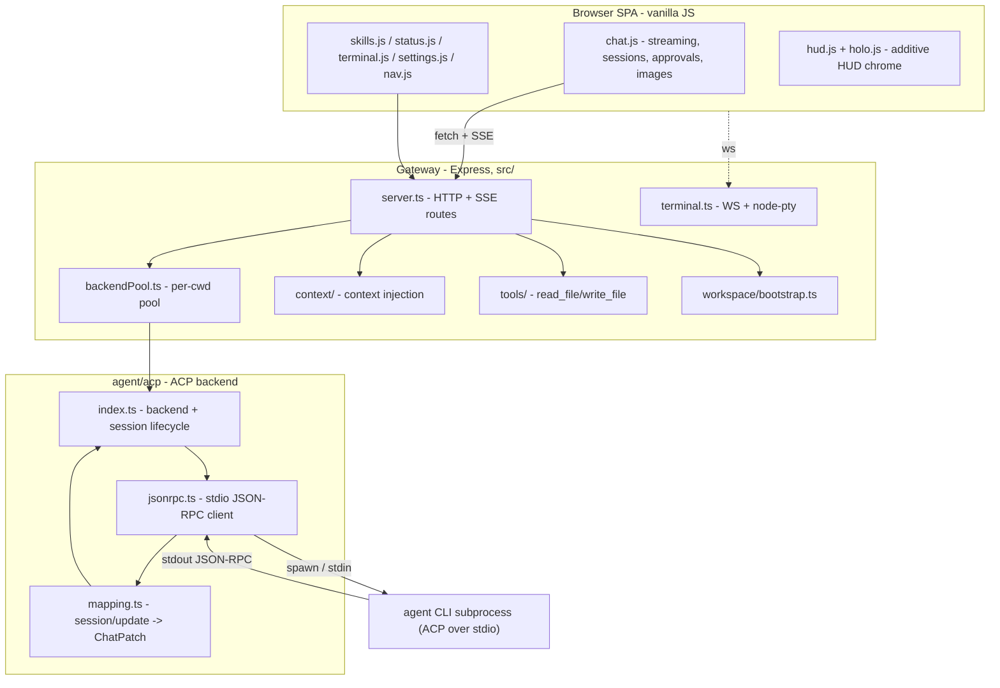
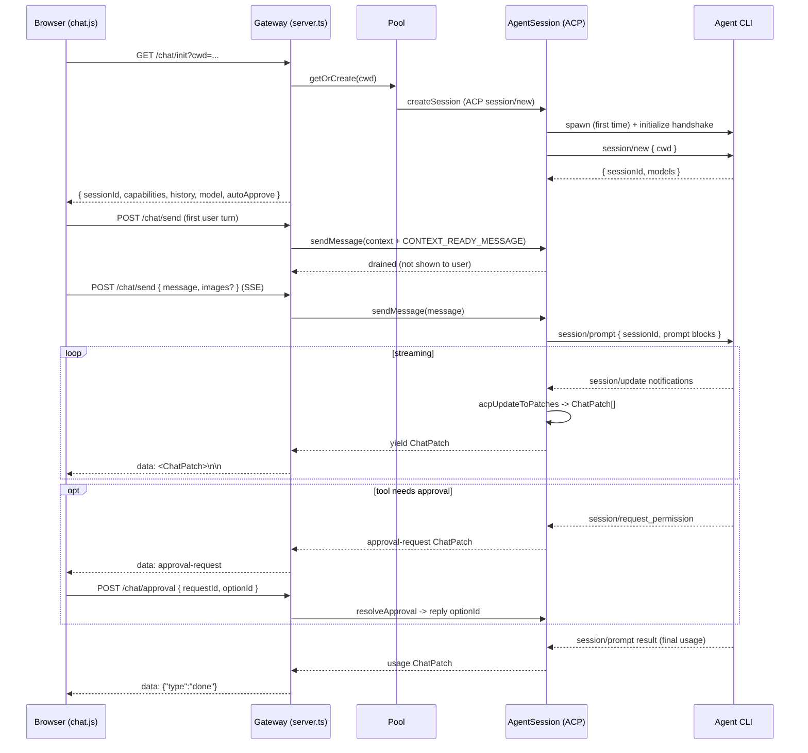

# 01 — Architecture

## Components

Jarvis Bridge is a single Node process (the **gateway**) plus one or more **agent CLI subprocesses**
it spawns and talks to over stdio. The browser is a static SPA the gateway serves.



| Layer | Files | Responsibility |
|---|---|---|
| Entry | `src/index.ts` | Bootstrap workspace, create backend + pool, healthcheck, start server, attach terminal. |
| Config | `src/config.ts` | Read env into a typed config object. |
| HTTP | `src/server.ts` | All Express routes; SSE streaming for chat. |
| Backend abstraction | `src/agent/types.ts`, `src/agent/index.ts` | The backend-agnostic interfaces + factory. |
| ACP backend | `src/agent/acp/*` | Spawn + talk ACP to the agent CLI; translate to `ChatPatch`. |
| Pool | `src/agent/backendPool.ts` | One backend per working directory. |
| Context | `src/context/index.ts` | Build a context string from workspace files. |
| Tools | `src/tools/*` | Workspace-scoped file read/write. |
| Workspace | `src/workspace/bootstrap.ts` | First-run setup, skills install. |
| Terminal | `src/terminal.ts` | WebSocket shell drawer. |

## Process model

- The gateway is **one** Node process.
- For each distinct working directory a chat targets, the gateway spawns **one** agent CLI
  subprocess (managed by the pool). The default workspace gets a backend eagerly at startup; other
  directories get one lazily on first use.
- The agent subprocess is long-lived: it stays up across many turns and many sessions. The gateway
  multiplexes multiple ACP **sessions** over a single subprocess connection.

> The original system also ran a second agent subprocess dedicated to scheduled (cron) jobs so they
> could not pollute the interactive context window. Cron is **out of scope** here, so there is a
> single agent role ("chat") and no second subprocess for automation.

## The backend-agnostic abstraction

All of the gateway above the `src/agent/acp/` layer is written against interfaces in
`src/agent/types.ts`, never against ACP directly. This keeps the server, pool, and context code
transport-neutral.

### `AgentCapabilities`

Static feature flags so the UI/server can gate features. Derived partly from the ACP handshake.

```ts
interface AgentCapabilities {
  multipleSessions: boolean;       // per-session isolation (ACP: yes)
  customWorkingDirectory: boolean; // fresh chats can target a custom cwd
  cancel: boolean;                 // mid-stream cancel of a turn
  steer: boolean;                  // mid-turn steering (from handshake)
  toolApprovals: boolean;          // surfaces tool-call permission requests
  slashCommands: boolean;          // server-advertised slash commands
  canFork: boolean;                // clone a session w/ shared history (from handshake)
  images: boolean;                 // accepts image attachments (from handshake)
}
```

### `AgentSession`

A single conversation. The only required streaming primitive is `sendMessage`, which returns an
async iterable of `ChatPatch` — the incremental wire contract the UI consumes.

```ts
interface AgentSession {
  readonly id: string;
  sendMessage(message: string, opts?: SendMessageOptions): AsyncIterable<ChatPatch>;
  cancel(): Promise<void>;
  steer?(prompt: string): Promise<{ accepted: boolean; reason?: string }>;
  resolveApproval?(requestId: string, optionId: string): boolean;
  getSlashCommands?(): Array<{ name: string; description?: string }>;
  consumeReplayHistory?(): ChatHistoryEntry[];
  close(): Promise<void>;
}

interface SendMessageOptions {
  signal?: AbortSignal;                 // cancel an in-flight turn
  images?: PromptImageAttachment[];     // only image-capable backends consume these
}

type ChatHistoryEntry =
  | { kind: "user"; content: string }
  | { kind: "assistant"; patches: ChatPatch[] };
```

### `AgentBackend`

A whole backend instance (the agent subprocess connection). Optional methods are gated by
`capabilities`.

```ts
interface AgentBackend {
  readonly kind: string;          // e.g. "acp"
  readonly role: "chat";          // only the chat role remains
  readonly capabilities: AgentCapabilities;

  healthcheck(opts?: { retries?: number }): Promise<{ ok: boolean; detail?: string }>;
  createSession(opts?: CreateSessionOptions): Promise<AgentSession>;

  loadSession?(sessionId: string, opts?: CreateSessionOptions): Promise<AgentSession>;
  listSessions?(): Promise<ChatSessionSummary[]>;
  forkSession?(sessionId: string, opts?: CreateSessionOptions): Promise<AgentSession>;
  getSessionModels?(sessionId: string):
    { available: Array<{ modelId: string; name: string }>; current: string } | null;
  setSessionModel?(sessionId: string, modelId: string): Promise<void>;

  shutdown(): Promise<void>;
}

interface CreateSessionOptions { cwd?: string; label?: string; }

interface ChatSessionSummary {
  sessionId: string;
  title?: string;
  updatedAt?: string | null;
  cwd?: string;
  // UI-side metadata (persisted by the gateway, not the agent):
  customTitle?: string;
  pinned?: boolean;
  group?: string;
  displayTitle?: string;
}

interface PromptImageAttachment { data: string; mimeType: string; filename?: string; }
```

> The original interface also defined a `runOnce(message)` fire-and-collect helper and a
> `rawCaptureExtension`, used only by the cron persistence path. Both are **omitted** here.

### Factory

```ts
// src/agent/index.ts
async function createAgentBackend(
  role: "chat",
  cfg: AgentBackendConfig,
  opts: { workspace: string; logsDir?: string }
): Promise<AgentBackend>;
```

It instantiates the ACP backend with the agent command/args, default cwd (`workspace`), and a
`logsDir` for subprocess stderr logs (defaults to `workspace`).

## Per-cwd backend pool

A chat can target an arbitrary project folder (not just the default workspace). Each distinct folder
gets its own agent subprocess so the agent runs with the right cwd. The pool owns this.

```ts
interface BackendPool {
  getDefaultBackend(): AgentBackend;
  getOrCreate(cwd: string): Promise<AgentBackend>;
  listBackends(): AgentBackend[];
  findSession(sessionId: string): Promise<{ backend; cwd; summary } | null>;
  listSessions(): Promise<Array<{ backend; cwd; summary }>>;
}
```

Implementation notes:

- Key everything by `path.resolve(cwd)`.
- Keep two maps: a `Map<string, Promise<AgentBackend>>` (stores the **in-flight** creation promise to
  dedupe concurrent requests for the same cwd) and a `Map<string, AgentBackend>` (resolved instances,
  for the synchronous `listBackends`).
- Seed the default workspace's backend eagerly into both maps at startup.
- `getOrCreate` returns the cached promise if present; otherwise calls the injected `createBackend`,
  caches the resolved instance on success, and **deletes both cache entries on failure** so a failed
  spawn does not poison the cache.
- Pin every per-cwd backend's stderr log directory to the canonical workspace (so opening a chat
  against a project folder does not scatter log dirs into that folder).
- `listSessions` fans out across all backends, calling each backend's optional `listSessions`, and
  tags each summary with its owning backend + cwd. `findSession` linear-scans that flattened list.

## End-to-end: a chat turn



The same `ChatPatch` stream is what the frontend renders live and what it replays when restoring a
past session's history — implement the renderer once. See
[02-acp-backend.md](02-acp-backend.md) for the `ChatPatch` contract and the mapping, and
[04-frontend.md](04-frontend.md) for the renderer.
