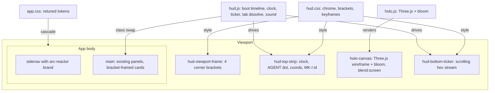

# 05 — UI Design System (JARVIS HUD)

This is the **target visual language** for Jarvis Bridge: a Stark/JARVIS-style HUD. It is the
baseline look, not an optional retheme — but it is implemented as an **additive layer** over the
behavior layer in [04-frontend.md](04-frontend.md). Every behavior targets stable DOM IDs; the HUD
only restyles them and adds decorative chrome (corner brackets, status strip, ticker, holographic
canvas). Nothing in this doc changes application logic.

> Build the app on a plain theme first (Phase 4), then apply this (Phase 5). The key trick: keep the
> `:root` design-token **names** stable, so swapping their **values** recolors the whole app.

## Locked visual spec

- **Palette:** cyan `#5be9ff` primary, amber `#ffb84a` for warnings/highlights, red `#ff3b3b` for
  danger, near-black `#02060a` background with a subtle dotted-grid overlay. Unify success → cyan
  (no green).
- **Typography:** `Orbitron` for display (brand, headings, eyebrows); `JetBrains Mono` for
  body/UI/code. Loaded from Google Fonts.
- **Treatment:** thin 1px cyan strokes; additive glow via `drop-shadow`/`box-shadow` (not soft drop
  shadows); sharp/chamfered corners (no rounded); ALL-CAPS section headers; dense small mono readouts.
- **Motion:** a GSAP timeline for the boot reveal (sidenav → chrome → main, 30–80ms stagger); a
  rotating arc-reactor brand; a streaming bottom ticker; a particle/dust dissolve on panel switches.

## 1. Design tokens — `public/css/app.css`

Rewrite the `:root` token block to JARVIS values. **Keep the token names identical** to the plain-
theme version so all downstream CSS picks up the new look automatically.

```css
:root {
  --color-bg: #02060a;
  --color-surface-1: rgba(91, 233, 255, 0.04);
  --color-surface-2: rgba(91, 233, 255, 0.06);
  --color-text: #d8f5ff;
  --color-text-muted: rgba(216, 245, 255, 0.7);
  --color-border: rgba(91, 233, 255, 0.25);
  --color-border-strong: #5be9ff;
  --color-accent: #5be9ff;
  --color-accent-strong: #5be9ff;
  --color-accent-tint: rgba(91, 233, 255, 0.18);
  --color-success: #5be9ff;   /* unified cyan, no green */
  --color-warning: #ffb84a;
  --color-danger: #ff3b3b;

  --font-sans: 'Orbitron', system-ui, sans-serif;
  --font-mono: 'JetBrains Mono', ui-monospace, monospace;

  --radius-sm: 0;
  --radius-md: 2px;
  --radius-lg: 2px;           /* sharp corners everywhere */

  --shadow-md: 0 0 14px rgba(91, 233, 255, 0.35);  /* glow, not drop-shadow */
}
```

Also:
- Body gets a radial-gradient + a dotted-grid overlay background.
- Add utility classes `.glow`, `.bracket-frame`, `.scanline` (see `hud.css`).
- Sweep raw `border-radius: <n>` literals to `var(--radius-md)` so corner sharpness lands everywhere.
- Keep a small set of back-compat aliases (`--bg`, `--surface`, `--text`, `--accent`, `--border`) if
  the plain theme used them, pointing at the new values.

## 2. HUD chrome HTML — `public/index.html`

Add four structural pieces around the existing `sidenav` + `main` (none interfere with existing IDs
or listeners), plus the holographic canvas:

```html
<body>
  <div class="hud-viewport-frame" aria-hidden="true">
    <!-- four absolutely-positioned corner brackets, full viewport -->
  </div>

  <div class="hud-top-strip" aria-hidden="true">
    <span class="hud-time" id="hud-time">--:--:--</span>
    <span class="hud-sep"></span>
    <span class="hud-agent-state">AGENT <span id="hud-agent-dot" class="hud-dot"></span></span>
    <span class="hud-sep"></span>
    <span class="hud-coords" id="hud-coords"></span>
    <span class="hud-spacer"></span>
    <span class="hud-id">JARVIS BRIDGE // MK-I</span>
  </div>

  <aside class="sidenav"> ... existing markup ... </aside>
  <main> ... existing markup ... </main>

  <canvas id="holo-canvas" class="holo-canvas" aria-hidden="true"></canvas>

  <div class="hud-bottom-ticker" aria-hidden="true">
    <div class="hud-ticker-track" id="hud-ticker"></div>
  </div>
</body>
```

Also:
- Swap the brand-mark glyph and the chat empty-state glyph for an inline **arc-reactor SVG** (3
  nested rings rotating at different speeds — pure SVG + CSS, no JS).
- Add `<link rel="preconnect">` + Google Fonts `<link>` for Orbitron / JetBrains Mono.
- Add CDN scripts **after** the existing behavior scripts:

```html
<script src="https://cdn.jsdelivr.net/npm/three@0.169.0/build/three.min.js"></script>
<script src="https://cdn.jsdelivr.net/npm/gsap@3.12.5/dist/gsap.min.js"></script>
<script src="/js/hud.js"></script>
<script src="/js/holo.js"></script>
```

> **Three.js loading caveat.** The non-module `three.min.js` global build cannot `import` `examples/jsm`
> addons (e.g. `UnrealBloomPass`) directly. If you want post-processing addons, load three as an ES
> module via an import map instead of the global `<script>` shown above; otherwise keep `holo.js` to
> the core `THREE` global (no jsm addons) and fake bloom with an additive glow material / CSS. `holo.js`
> must also no-op gracefully when `THREE` is absent or `prefers-reduced-motion` is set, so the HUD never
> hard-depends on the CDN.

> Genericization note: the top strip shows a generic **AGENT** health dot (polling
> `GET /health/agent`) and the identifier `JARVIS BRIDGE // MK-I`. There is no product-specific
> backend label.

## 3. New stylesheet — `public/css/hud.css`

Co-located with `app.css`, kept separate so the chrome can be reasoned about in isolation. Linked
after `app.css`. Contains:

- `.hud-viewport-frame` corner brackets (4 absolutely positioned ~24×24 SVG-styled corners).
- `.hud-top-strip` and `.hud-bottom-ticker` (fixed, full-width, ~28px tall, 1px cyan border, glow).
- `.hud-ticker-track` (CSS keyframe scrolling left at constant speed).
- `.scanline` (animated horizontal line drifting down `main`).
- `.holo-canvas` (`position: fixed; pointer-events: none; opacity: 0.6; z-index: -1; mix-blend-mode: screen`).
- `.arc-reactor` SVG class + ring-rotation keyframes.
- `.bracket-frame` utility (corner brackets wrapping any element — used to reframe `.card`, the chat
  empty card, modal headers).
- `@keyframes`: `boot-fade`, `boot-rise`, `dust-in`, `dust-out`, `ring-spin`, `scanline-sweep`,
  `ticker-scroll`.
- A small scoped tweak to the highlight.js theme (cyan keywords) so code blocks match.

## 4. New script — `public/js/hud.js`

Drives the JARVIS-specific behaviors. No dependency on the behavior scripts; coexists safely.

- **Boot sequence:** on `DOMContentLoaded`, a GSAP timeline fades in the viewport frame → top strip →
  sidenav sections (staggered) → main → bottom ticker (~700ms). Skipped under
  `prefers-reduced-motion`.
- **Clock:** update `#hud-time` every second to `HH:MM:SS` UTC.
- **Agent status pulse:** poll `GET /health/agent`; drive `#hud-agent-dot`'s color class
  (cyan / amber / red).
- **Coords:** cycle decorative `LAT … LON …` from a deterministic pseudo-random sequence.
- **Ticker:** continuously append fake hex/binary segments to `#hud-ticker` mixed with real signal
  (current panel id, session id), reading existing globals where present. Throttle to ~6 Hz.
- **Tab dissolve:** via event delegation on the sidenav nav, wrap the panel switch with a ~120ms
  `dust-out`/`dust-in` class swap. (Does not replace the router — it only adds the transition class.)
- **Optional sound:** gated behind a localStorage flag (`hud:sound=on`); a tiny WebAudio synth emits
  a short cyan-bleep on tab switch / message send. No external assets.

## 5. New script — `public/js/holo.js`

The Three.js holographic wireframe canvas.

- Mount to `#holo-canvas`, sized to the viewport with a `devicePixelRatio` cap of 2.
- Render an `EdgesGeometry` wireframe (default `IcosahedronGeometry(2, 1)` — reads like an arc-reactor
  core) with an additive-blended cyan `LineBasicMaterial`.
- A second pass: a thin rotating `TorusGeometry` "orbit ring" at a 90° offset.
- Idle animation: slow Y-rotation (~0.15 rad/s) + gentle `sin(elapsed)` scale pulse.
- Use a bloom post-process pass (`UnrealBloomPass` from `three/addons` postprocessing, via the same
  CDN) — bloom is what makes this read as a hologram rather than CAD.
- Pause rendering on `visibilitychange` when hidden.
- Honor `prefers-reduced-motion` → render a single static frame only.
- Clean up on `pagehide`. A localStorage kill switch (`hud:holo=off`) disables it entirely.

## 6. Mirror palette into skill UIs — `public/css/skill-ui.css`

Iframed skill UIs opt into this shared stylesheet. Update its duplicated token block to the same
JARVIS values (cyan/amber/red on near-black), set button/control corners to 0–2px, and the focus
border to cyan, so skills stay visually consistent with the host app.

## 7. Composition diagram



## 8. Accessibility & performance (required)

- All new chrome is `aria-hidden="true"` and out of the tab order — it is decorative.
- Contrast: cyan on near-black is comfortably above WCAG AA for text.
- `prefers-reduced-motion` is respected everywhere: the boot sequence is skipped, the scanline and
  ticker freeze, and the holo renders a single frame.
- The holo canvas is GPU-cheap (wireframe + one bloom pass) but pauses when the tab is hidden and has
  a localStorage kill switch, so it is safe on integrated GPUs.

## 9. Validation pass

After implementing, walk the behavior flows with the HUD on: chat send / stream / queue / stop;
switch sessions; fork; attach an image; open the terminal drawer; open a skill iframe; toggle
`prefers-reduced-motion`; then a quick Lighthouse perf/a11y check.
