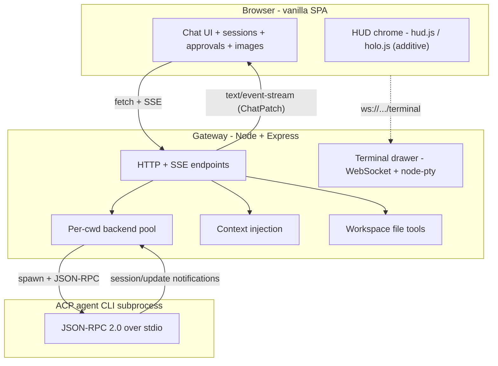

# Jarvis Bridge — Re-implementation Specification

This folder is a complete, implementation-ready specification for building **Jarvis Bridge** from
scratch in a fresh repository. It is written to be executed by an AI coding agent (or a human),
with enough detail to recreate the design, architecture, and behavior of the application without
referring back to the original source.

> These docs describe a clean-room re-implementation. They are intentionally free of any
> organization-specific dependencies, service names, or branding. Every name used here
> (product name, env vars, paths) is arbitrary and can be renamed freely.

## What is Jarvis Bridge?

Jarvis Bridge is a **localhost gateway** that pairs a rich web UI with a headless AI coding-agent
CLI. It is the cockpit you "fly" your agent from:

- A **browser UI** (vanilla HTML/CSS/JS, no build step) for chatting with the agent, browsing past
  sessions, approving tool calls, switching models, attaching images, and steering a turn mid-flight.
- A **gateway server** (Node + TypeScript + Express) that owns the agent subprocess, injects
  workspace context, exposes file tools, and streams the agent's output to the browser in real time.
- An **agent backend** that speaks the **Agent Client Protocol (ACP)** — JSON-RPC 2.0 over
  newline-delimited JSON on the stdin/stdout of a long-lived agent CLI subprocess.

The UI follows a **JARVIS-style HUD** visual language: a cyan/amber/red palette on near-black,
sci-fi typography, cockpit chrome (viewport corner brackets, a top status strip, a bottom data
ticker), an animated boot reveal, and a Three.js holographic wireframe canvas with bloom. The HUD is
an **additive visual layer** over a behavior layer with stable DOM IDs, so the application logic is
completely theme-independent.

## Tech stack

| Concern | Choice |
|---|---|
| Runtime | Node.js (>= 20), TypeScript (ES2022 target, CommonJS modules) |
| Web framework | Express |
| Frontend | Vanilla HTML/CSS/JS — **no framework, no build step** |
| Agent transport | JSON-RPC 2.0 over newline-delimited JSON on subprocess stdio (ACP) |
| Validation | Zod (at the HTTP boundary) |
| Terminal | `ws` + `node-pty` |
| Markdown (frontend) | `marked` + `dompurify` + `highlight.js` (CDN) |
| HUD libs (frontend) | `three` + `gsap` + Google Fonts (CDN) |
| MCP (optional) | `@modelcontextprotocol/sdk` |

## How to read these docs

Start with the execution roadmap, then read the detailed docs as each phase needs them.

| Doc | What it covers |
|---|---|
| [00-execution-phases.md](00-execution-phases.md) | **Start here.** Phase-wise build roadmap with goals, deliverables, and checklists. |
| [01-architecture.md](01-architecture.md) | Components, process model, the `AgentBackend`/`AgentSession` abstraction, the per-cwd pool. |
| [02-acp-backend.md](02-acp-backend.md) | The ACP transport, handshake, session ops, the `session/update` → `ChatPatch` mapping, image handling, healthcheck. |
| [03-http-api.md](03-http-api.md) | Complete Express endpoint reference, including the SSE framing for `/chat/send`. |
| [04-frontend.md](04-frontend.md) | Frontend behavior: SPA shell, modules, the shared SSE renderer, and the additive HUD modules. |
| [05-ui-design-system.md](05-ui-design-system.md) | The JARVIS HUD design system: tokens, `hud.css`, the holographic canvas, motion, a11y/perf. |
| [06-context-and-workspace.md](06-context-and-workspace.md) | Context injection, first-run bootstrap, workspace layout, the skill-UI convention. |
| [07-tools-and-mcp.md](07-tools-and-mcp.md) | The workspace-scoped tool registry and the optional MCP server. |
| [08-terminal-and-integrations.md](08-terminal-and-integrations.md) | The terminal drawer, the Slack helper, and the generic event-hooks interface. |
| [09-config-and-setup.md](09-config-and-setup.md) | Env var reference, project structure, dependencies, build/run, and a build checklist. |

## Scope and exclusions

This spec covers the ACP/stdio agent backend, the chat UI, context injection, workspace bootstrap,
file tools, an optional MCP server, the terminal drawer, and the JARVIS HUD. The following are
**intentionally excluded** from the re-implementation:

- Any non-ACP (e.g. HTTP) agent backend.
- The cron / scheduled-automation feature (scheduler, job store, executions UI, the second
  agent backend role, and the natural-language scheduling helper).
- Voice / speech-to-text input.
- Any real analytics client — analytics is documented only as an optional, no-op-by-default
  event-hooks interface.
