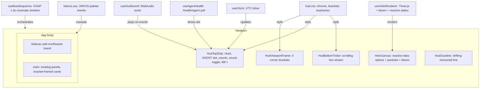

# Phase 5 — JARVIS HUD Design System

> **Status:** Design approved, pending implementation plan
> **Spec source:** [05-ui-design-system.md](../../implementation/05-ui-design-system.md)
> **Scope:** Additive visual layer over Phase 4 behavioral frontend. Zero behavior changes.

---

## 1. Architecture & Layer Model

Phase 5 is an **additive layer** — it restyles and adds decorative chrome without touching any
application logic. The key departure from the original spec: **everything is implemented as React
components and hooks** within the Vite/React pipeline, not standalone vanilla JS files.

```
┌─────────────────────────────────────────────────────┐
│  Layer 4: HUD Chrome (corner brackets, strips,      │
│           ticker, scanline)          aria-hidden     │
├─────────────────────────────────────────────────────┤
│  Layer 3: React SPA (behavioral layer)              │
│           Sidenav + main panels, unchanged logic     │
├─────────────────────────────────────────────────────┤
│  Layer 2: Three.js Data Sphere Canvas               │
│           z-index: -1, mix-blend-mode: screen       │
├─────────────────────────────────────────────────────┤
│  Layer 1: Body background                           │
│           Radial gradient + dotted grid overlay      │
└─────────────────────────────────────────────────────┘
```

### Key Architectural Decisions

1. **Token-driven repaint**: Same CSS custom property names, new JARVIS values → entire app
   recolors automatically.
2. **Chrome is purely decorative**: All HUD elements are `aria-hidden="true"`, zero tab-order
   impact.
3. **React-native implementation**: Three.js and GSAP are npm dependencies (tree-shaken by Vite),
   not CDN script tags. All HUD logic lives in React components and hooks.
4. **Graceful degradation**: Every effect (GSAP, Three.js, WebAudio) no-ops safely if the
   dependency fails or `prefers-reduced-motion` is set.

### File Structure

```
frontend/src/
├── hud/                          # HUD subsystem (Phase 5)
│   ├── HudShell.tsx              # Top-level wrapper: chrome scaffold, boot orchestration
│   ├── HudTopStrip.tsx           # Clock, agent health dot, coords, brand ID
│   ├── HudBottomTicker.tsx       # Scrolling hex/data ticker
│   ├── HudViewportFrame.tsx      # Four corner brackets (SVG)
│   ├── HudScanline.tsx           # Animated scanline across main
│   ├── ArcReactor.tsx            # SVG arc-reactor brand (rotating rings)
│   ├── HoloCanvas.tsx            # Three.js data sphere (useEffect + useRef)
│   ├── hooks/
│   │   ├── useBootSequence.ts    # GSAP timeline hook
│   │   ├── useClock.ts           # UTC clock ticker
│   │   ├── useAgentHealth.ts     # /health/agent polling → dot color
│   │   ├── useHudSound.ts        # WebAudio synth hook
│   │   ├── useReducedMotion.ts   # prefers-reduced-motion media query
│   │   └── useHoloRenderer.ts    # Three.js scene lifecycle
│   ├── styles/
│   │   ├── hud.css               # Chrome styles, keyframes, utilities
│   │   └── skill-ui.css          # Mirrored tokens for iframed skill UIs
│   └── utils/
│       ├── ticker-data.ts        # Hex/binary segment generator
│       └── sound-synth.ts        # WebAudio chord + bleep functions
├── styles/
│   ├── tokens.css                # ← REWRITTEN to JARVIS palette (same names)
│   └── global.css                # ← minor additions (grid overlay, utilities)
```

### Integration Point

`HudShell` wraps the entire `App`, injecting chrome:

```tsx
<HudShell>
  <HoloCanvas />
  <HudViewportFrame />
  <HudTopStrip />
  <div className="app-body">
    <Sidenav ... />
    <main> ... </main>
  </div>
  <HudBottomTicker />
  <HudScanline />
</HudShell>
```

---

## 2. Design Tokens — Visual Foundation

### Token Rewrite (`tokens.css`)

Same token names, new JARVIS values:

| Token | Plain Theme | JARVIS |
|---|---|---|
| `--color-bg` | `#11161b` | `#02060a` |
| `--color-surface-1` | `#182027` | `rgba(91,233,255,0.04)` |
| `--color-surface-2` | `#202a33` | `rgba(91,233,255,0.06)` |
| `--color-surface-3` | `#2a3640` | `rgba(91,233,255,0.08)` |
| `--color-text` | `#e6edf3` | `#d8f5ff` |
| `--color-text-muted` | `#8b98a5` | `rgba(216,245,255,0.7)` |
| `--color-border` | `#2c3742` | `rgba(91,233,255,0.25)` |
| `--color-border-strong` | `#4a5862` | `#5be9ff` |
| `--color-accent` | `#4ea3ff` | `#5be9ff` |
| `--color-accent-strong` | `#2d8cff` | `#5be9ff` |
| `--color-accent-tint` | `rgba(78,163,255,0.15)` | `rgba(91,233,255,0.18)` |
| `--color-success` | `#3fb950` (green) | `#5be9ff` (cyan unified) |
| `--color-warning` | `#d29922` | `#ffb84a` |
| `--color-danger` | `#f85149` | `#ff3b3b` |
| `--font-sans` | system fonts | `'Orbitron', system-ui, sans-serif` |
| `--font-mono` | system mono | `'JetBrains Mono', ui-monospace, monospace` |
| `--radius-sm` | `2px` | `0` |
| `--radius-md` | `4px` | `2px` |
| `--radius-lg` | `6px` | `2px` |
| `--shadow-md` | `0 2px 8px rgba(0,0,0,0.3)` | `0 0 14px rgba(91,233,255,0.35)` |

### Body Background (`global.css`)

```css
body {
  background:
    radial-gradient(ellipse at 50% 0%, rgba(91,233,255,0.06) 0%, transparent 60%),
    var(--color-bg);
}
body::after {
  content: '';
  position: fixed;
  inset: 0;
  pointer-events: none;
  background-image: radial-gradient(rgba(91,233,255,0.15) 1px, transparent 1px);
  background-size: 20px 20px;
  z-index: 0;
  opacity: 0.3;
}
```

### Fonts (`index.html`)

```html
<link rel="preconnect" href="https://fonts.googleapis.com">
<link rel="preconnect" href="https://fonts.gstatic.com" crossorigin>
<link href="https://fonts.googleapis.com/css2?family=Orbitron:wght@400;600;700&family=JetBrains+Mono:wght@400;500&display=swap" rel="stylesheet">
```

### New Utility Classes (`hud.css`)

- `.glow` — `box-shadow: 0 0 14px rgba(91,233,255,0.35); filter: drop-shadow(0 0 6px rgba(91,233,255,0.3))`
- `.bracket-frame` — injects corner bracket pseudo-elements (used on `.card`, modals, chat empty state)
- `.scanline` — animated horizontal line sweep class

---

## 3. HUD Chrome Components

### 3a. `HudViewportFrame` — Corner Brackets

Four absolutely-positioned SVG corner brackets at the viewport edges. Classic JARVIS targeting
reticle framing.

- Pure SVG `<path>` elements, `stroke: var(--color-accent)`, `stroke-width: 1`
- Subtle glow via `filter: drop-shadow(0 0 4px var(--color-accent))`
- Boot animation: corners slide inward from off-screen

### 3b. `HudTopStrip` — Status Bar

Fixed, full-width, ~28px tall strip at top:

```
HH:MM:SS UTC │ AGENT ● │ LAT 40.7128° LON -74.0060° │ 🔊 ─── JARVIS BRIDGE // MK-I
```

- **Clock** (`useClock`): `HH:MM:SS` UTC, Orbitron font, updated every second
- **Agent health dot** (`useAgentHealth`): polls `GET /health/agent`, drives color — cyan
  (healthy), amber (degraded), red (unreachable)
- **Coordinates**: cycling pseudo-random `LAT/LON` from deterministic sequence
- **Sound toggle**: speaker icon, toggles `hud:sound` in localStorage
- **Brand ID**: `JARVIS BRIDGE // MK-I` right-aligned
- **Creative**: Real agent metrics (token count, session ID) mixed into readouts
- Styling: 1px cyan bottom border, glow, `backdrop-filter: blur(4px)`

### 3c. `HudBottomTicker` — Streaming Data Ticker

Fixed at bottom, full-width, ~28px tall. Continuously scrolling hex/data track:

```
◄ FF A2 3B 01 session:a7f3c2 █ 00 1F E7 tokens:1,247 █ D4 8C 2A panel:chat █ ...
```

- CSS `@keyframes ticker-scroll` moves track left at constant speed
- Mix of fake hex/binary + real signal (panel ID, session ID, token count)
- Throttled to ~6 Hz for content updates
- Orbitron font, 10px, `opacity: 0.6`

### 3d. `HudScanline` — Animated Horizontal Line

Thin cyan line drifting downward across `<main>`, repeating every ~8s.

```css
@keyframes scanline-sweep {
  0% { top: -2px; }
  100% { top: 100%; }
}
```

- `height: 1px`, gradient fade on both edges, `opacity: 0.15`

### 3e. `ArcReactor` — Brand SVG

Replaces "Jarvis Bridge" text in sidenav header. Three nested concentric rings:

- **Outer ring**: 20s rotation, 1px cyan stroke
- **Middle ring**: 12s counter-rotation, slightly thicker
- **Inner ring**: 8s rotation, brightest glow
- **Core**: solid circle with radial gradient
- **Creative**: Rotation speed increases when agent is streaming; pulses brighter on message send

---

## 4. Three.js Data Sphere — Reactive Hologram

### 4a. `HoloCanvas` + `useHoloRenderer`

The centerpiece: a Three.js holographic wireframe that **reacts to agent activity**.

**Geometry:**
- Base: `IcosahedronGeometry(2, 1)` as `EdgesGeometry` wireframe
- Material: `LineBasicMaterial`, cyan, `blending: THREE.AdditiveBlending`
- Secondary `TorusGeometry` orbit ring at 90° offset

**Post-processing:**
- `EffectComposer` + `UnrealBloomPass` (`strength: 1.5, radius: 0.4, threshold: 0.1`)
- This bloom is what makes it read as "hologram" vs "CAD wireframe"

**Canvas setup:**
- `position: fixed; inset: 0; z-index: -1; pointer-events: none; mix-blend-mode: screen; opacity: 0.6`
- `devicePixelRatio` capped at 2

**Idle state:**
- Slow Y-rotation (~0.15 rad/s)
- Gentle `sin(elapsed)` scale pulse (0.98 → 1.02)
- Floating particles (20-30 small `THREE.Points`) drifting around the sphere

**Reactive states:**

| Agent State | Sphere Response |
|---|---|
| Idle | Slow breathing rotation, dim glow |
| Streaming (responding) | Vertices brighten in cascading pattern, 3x rotation speed, particles emit from vertices |
| Tool call in progress | Orbit ring accelerates, amber tint blends in |
| Error / Permission denied | Red flash on edges, glitch vertex displacement for 200ms |
| User typing | Subtle scale-up (anticipation), cyan pulse at core |

**State communication:** Subscribes to React context / event bus from existing chat state. Reads
published state only — no coupling to behavioral code.

### 4b. Particle Field

20-30 floating particles via `THREE.Points` with `THREE.BufferGeometry`. During streaming, particles
accelerate toward the sphere (data flowing into the agent's "brain"). GPU-cheap.

### 4c. Performance Safeguards

- `devicePixelRatio` capped at 2
- Pause rendering on `visibilitychange` (tab hidden)
- `prefers-reduced-motion` → single static frame
- localStorage kill switch: `hud:holo=off`
- `pointer-events: none` on canvas

---

## 5. GSAP Boot Sequence

### `useBootSequence` — Cinematic Boot (~1.5s)

Plays on every page load. Full cinematic Iron Man suit-up feel:

```
T+0ms     Black screen, hex matrix rain starts (CSS overlay)
T+200ms   Power-on chord (WebAudio)
T+300ms   Corner brackets slide in from edges
T+400ms   Top strip fades in + slides down
T+500ms   Sidenav sections stagger in (30-80ms each)
T+700ms   Main content area fades in + rises
T+900ms   Holo sphere fades in with bloom ramp
T+1100ms  Bottom ticker starts scrolling
T+1300ms  Hex matrix rain fades out
T+1500ms  Boot complete, all elements at final state
```

- GSAP `timeline` with `staggerFrom`/`staggerTo` on refs
- `prefers-reduced-motion`: skip entirely, show everything at once

### Tab Dissolve (Route Change Transition)

```css
@keyframes dust-out {
  to { opacity: 0; filter: blur(4px); transform: scale(0.98); }
}
@keyframes dust-in {
  from { opacity: 0; filter: blur(4px); transform: scale(1.02); }
}
```

~120ms transition wrapper around route switches in `App.tsx`.

### Glitch Effect on Errors

```css
@keyframes glitch {
  0%, 100% { transform: translate(0); filter: none; }
  20% { transform: translate(-2px, 1px); filter: hue-rotate(90deg); }
  40% { transform: translate(2px, -1px); filter: hue-rotate(-90deg); }
  60% { transform: translate(-1px, -2px); }
  80% { transform: translate(1px, 2px); }
}
```

Applied to `.app-body` for ~300ms on error events.

---

## 6. Sound Design — WebAudio Synth

### `useHudSound` + `sound-synth.ts`

All sounds synthesized via Web Audio API — no external audio files.

| Event | Sound | Implementation |
|---|---|---|
| Boot chord | Deep power-up sweep, 80Hz→440Hz over 1.2s with harmonics | Two oscillators (sine+triangle), freq ramp, gain envelope, reverb |
| Tab switch | Quick sine blip at 880Hz, 60ms | Single oscillator, quick gain envelope |
| Message send | Upward chirp 440Hz→660Hz, 100ms | Oscillator with frequency ramp |
| Agent response start | Subtle low hum 120Hz, soft | Sine oscillator, slow gain fade |
| Error/denial | Distorted buzz 200Hz, 150ms | Two detuned square oscillators |
| Approval modal | Two-tone chime 660Hz→880Hz, 80ms each | Sequence of two oscillators |

### Controls

- **Default**: Sound ON
- **Mute toggle**: Speaker icon in `HudTopStrip`, toggles `hud:sound` in localStorage
- **Auto-mute**: When `document.hidden` (tab unfocused)
- `AudioContext` created lazily on first user interaction (browser autoplay policy)

---

## 7. Skill UI Mirror — `skill-ui.css`

Iframed skill UIs opt into a shared stylesheet. Token block duplicated with JARVIS values:
- Same cyan/amber/red palette
- Button/control corners: 0-2px
- Focus border: cyan
- Typography: JetBrains Mono body

---

## 8. Accessibility & Performance

### Accessibility

- All chrome: `aria-hidden="true"`, out of tab order
- Contrast: `#5be9ff` on `#02060a` = ~12.5:1 ratio (WCAG AAA)
- `prefers-reduced-motion` respected everywhere:
  - Boot sequence: skipped
  - Scanline, ticker: frozen
  - Holo canvas: single static frame
  - Tab dissolve: instant swap
  - Arc reactor: static
  - Glitch effect: disabled

### Performance

- Three.js: `devicePixelRatio` cap at 2, pause on hidden
- GSAP: timeline completes and releases references
- Ticker: `requestAnimationFrame` throttled to ~6 Hz
- Fonts: `preconnect` + `display=swap`
- All CSS animations: `transform`/`opacity` only (GPU composited)
- Kill switches: `hud:holo=off`, `hud:sound=off` in localStorage

---

## 9. Dependencies

```json
{
  "three": "^0.169.0",
  "gsap": "^3.12.5",
  "@types/three": "^0.169.0"
}
```

Tree-shaken by Vite — only imported modules ship.

---

## 10. Validation Checklist

Post-implementation, every Phase 4 flow must still work:

1. Chat send / stream / queue / stop
2. Switch sessions
3. Fork a session
4. Attach an image (paste/drop/picker)
5. Open the terminal drawer
6. Open a skill iframe
7. Toggle `prefers-reduced-motion` — all animations disable
8. Lighthouse perf/a11y check
9. Sound mute toggle works
10. `hud:holo=off` kills the Three.js canvas

---

## 11. Composition Diagram


