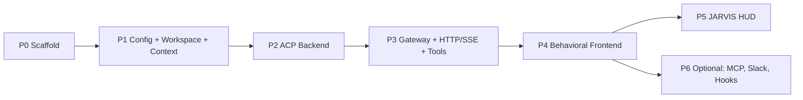

# 00 — Execution Phases

This is the build roadmap for an AI agent (or human) implementing Jarvis Bridge from scratch. Phases
are ordered by dependency. Each phase has a **goal**, the **source docs** to read, concrete
**deliverables**, and a **done when** checklist you can verify before moving on.

The order deliberately produces a working, usable application by the end of Phase 4 (on a plain
theme), then layers the JARVIS HUD on top in Phase 5, and finishes with optional integrations in
Phase 6. This matches the core design principle: **the HUD is additive chrome over a
theme-independent behavior layer.**

---

## Phase 0 — Repo scaffold & tooling

**Goal:** an empty-but-runnable TypeScript project skeleton.

**Read:** [09-config-and-setup.md](09-config-and-setup.md).

**Deliverables:**
- `package.json` with scripts: `dev` (`ts-node src/index.ts`), `build` (`tsc`), `start`
  (`node dist/index.js`), and (optional) `mcp`.
- `tsconfig.json` targeting ES2022, CommonJS, `strict: true`, `outDir: dist`, `rootDir: src`.
- Dependencies installed: `express`, `zod`, `ws`, `node-pty`, `jpeg-js`, `pngjs`, `dotenv`; dev:
  `typescript`, `ts-node`, `@types/*`.
- `.env.example` and a `.gitignore`.
- `src/index.ts` entry point that just logs and exits.
- `public/index.html` serving a "hello" page via `express.static`.

**Done when:** `npm run dev` starts the server, serves `public/`, and exits cleanly on Ctrl+C.

---

## Phase 1 — Config, workspace dir, context injection

**Goal:** the gateway can resolve its workspace, ensure the dir exists, and build a context string
to prepend to agent prompts.

**Read:** [06-context-and-workspace.md](06-context-and-workspace.md),
[09-config-and-setup.md](09-config-and-setup.md).

**Deliverables:**
- `src/config.ts` — reads env into a typed `config` object (workspace path, port, agent command/args,
  context-injection flags, etc.). Creates the workspace dir if missing.
- `src/context/index.ts` — `buildContext(workspace, mode, injectMode)`, `wrapMessageWithContext`,
  `CONTEXT_READY_MESSAGE`. Support `paths` and `full` modes.

> **Bootstrap is intentionally minimal.** No template files, no skill install, no onboarding flow.
> The workspace is just an empty directory used as the agent's cwd and the tools' path-traversal
> root. Any context injection reads files the user puts in the workspace themselves.

**Done when:** starting against an empty workspace creates the dir without error, and a unit
call to `buildContext` returns a sensible context block for both modes.

---

## Phase 2 — ACP agent backend over stdio

**Goal:** spawn the agent CLI, complete the ACP handshake, create a session, send a prompt, and
receive streamed `ChatPatch` events. **This is the heart of the system.**

**Read:** [02-acp-backend.md](02-acp-backend.md), [01-architecture.md](01-architecture.md).

**Deliverables:**
- `src/agent/types.ts` — the backend-agnostic interfaces (`AgentBackend`, `AgentSession`,
  `AgentCapabilities`, `ChatPatch`, `UsageTotals`, options types).
- `src/agent/acp/jsonrpc.ts` — a JSON-RPC 2.0 client over newline-delimited stdio (spawn, line
  framing tolerant of log noise, request/notification/response routing, error classes, exit handling).
- `src/agent/acp/mapping.ts` — `acpUpdateToPatches`: translate `session/update` into `ChatPatch[]`,
  plus usage normalization.
- `src/agent/acp/prompt-content.ts` + `src/agent/acp/image-resize.ts` — build ACP prompt blocks and
  downscale images to a byte budget.
- `src/agent/acp/index.ts` — the backend + session classes: `connect()` (handshake + capability
  negotiation), `createSession`/`loadSession`/`listSessions`/`forkSession`/`setSessionModel`,
  `sendMessage` (the streaming pump), `cancel`, `steer`, permission handling + auto-approve,
  `healthcheck` with a liveness probe.
- `src/agent/index.ts` — `createAgentBackend` factory.
- `src/agent/backendPool.ts` — per-cwd backend pooling.

**Done when:** a small script can create a session, send "read package.json", and print the streamed
patches (text deltas + a tool call + usage). Cancellation and a healthcheck both work.

---

## Phase 3 — Gateway: HTTP + SSE endpoints + tools

**Goal:** expose the backend over HTTP so a browser can drive a chat turn end-to-end.

**Read:** [03-http-api.md](03-http-api.md), [07-tools-and-mcp.md](07-tools-and-mcp.md).

**Deliverables:**
- `src/types.ts`, `src/tools/{index,readFile,writeFile}.ts` — workspace-scoped file tools + registry +
  path-traversal guard.
- `src/server.ts` — `createServer(...)` wiring all endpoints: `/health`, `/chat/init`,
  `/chat/send` (SSE), `/chat/cancel`, `/chat/sessions` (+ fork + PATCH),
  `/chat/approval`, `/chat/steer`, `/chat/model`, `/chat/auto-approve`, `/workspace/*`, `/skills/*`,
  `/tools/execute`, and the generic event-hooks stub. Serves `public/`.
- `src/index.ts` — bootstrap workspace, create backend + pool, healthcheck, start server, attach
  terminal server.

**Done when:** `curl`-ing `/chat/init` returns a session, and a raw SSE `POST /chat/send` streams
`ChatPatch` lines ending with `{"type":"done"}`.

---

## Phase 4 — Behavioral frontend (plain theme)

**Goal:** a usable web UI with no HUD styling yet — correctness first.

**Read:** [04-frontend.md](04-frontend.md), [03-http-api.md](03-http-api.md).

**Deliverables:**
- `public/index.html` — the full SPA shell with stable structural IDs (sidenav, panels, chat
  transcript, composer, info panel, approval modal, terminal drawer).
- `public/js/chat.js` — chat lifecycle, the SSE `ChatPatch` renderer (shared by live stream and
  restored history), sessions sidebar, fork/steer/model/auto-approve, image paste/drop/attach,
  onboarding + context priming, notifications/favicon.
- `public/js/skills.js`, `public/js/status.js`, `public/js/terminal.js`, `public/js/settings.js`,
  `public/js/analytics.js` (no-op stub), and `public/js/nav.js` (hash tab router + toasts + confirm
  modal helpers).
- `public/css/app.css` — a plain dark theme using a `:root` design-token block (token **names** will
  be reused unchanged in Phase 5).

**Done when:** you can chat with streaming output, approve a tool call, switch sessions, fork, attach
an image, and open the terminal drawer — all in a plain theme.

---

## Phase 5 — JARVIS HUD design system

**Goal:** repaint into the JARVIS HUD and add cockpit chrome **without changing any behavior**.

**Read:** [05-ui-design-system.md](05-ui-design-system.md).

**Deliverables:**
- Rewrite the `:root` token block in `app.css` to the JARVIS palette/typography/corners/glow (names
  unchanged, so downstream CSS recolors automatically); add body grid overlay + utilities.
- `public/css/hud.css` — viewport corner brackets, top strip, bottom ticker, scanline,
  `.glow`/`.bracket-frame` utilities, keyframes.
- `public/index.html` — add the HUD chrome scaffold, arc-reactor brand SVG, Google Fonts +
  `three` + `gsap` CDN tags, and `hud.js`/`holo.js` script tags.
- `public/js/hud.js` — GSAP boot reveal, UTC clock, AGENT `/health` poll, decorative ticker, tab
  dissolve, optional WebAudio bleeps; honors `prefers-reduced-motion`.
- `public/js/holo.js` — Three.js wireframe + orbit ring + bloom canvas; pause-on-hidden;
  reduced-motion single frame; localStorage kill switch.
- `public/css/skill-ui.css` — mirror the token block so iframed skill UIs match.

**Done when:** every Phase 4 flow still works, the app reads as a JARVIS HUD, and toggling
`prefers-reduced-motion` disables animation cleanly.

---

## Phase 6 — Optional integrations & polish

**Goal:** the extras, each independently skippable.

**Read:** [07-tools-and-mcp.md](07-tools-and-mcp.md),
[08-terminal-and-integrations.md](08-terminal-and-integrations.md).

**Deliverables (pick what you need):**
- `src/slack/postMessage.ts` + `POST /slack/message`.
- The generic event-hooks interface (`GET /analytics/config` + `POST /analytics/track`) as a no-op.
- `src/mcp-server.ts` — the optional stdio MCP server (a thin HTTP client of the gateway), plus the
  pattern for registering new MCP tools.
- `start.sh` / `stop.sh` for multi-instance runs; QA pass; README.

**Done when:** the chosen extras work and the project builds clean (`npm run build`) with no type
errors.

---

## Cross-phase principles

- **Behavior is theme-independent.** Frontend logic targets stable DOM IDs; the HUD only adds chrome
  and restyles. Never couple a behavior module to a HUD class.
- **Protocol names are verbatim.** ACP method names (`session/new`, `session/prompt`,
  `session/update`, `session/request_permission`, …) and the `ChatPatch` shape are the contract —
  keep them exactly.
- **Validate at the HTTP boundary.** Use Zod for request bodies; keep the agent/transport layers
  validator-agnostic.
- **Fail safe on permissions.** When auto-approve is off (or no live stream exists), default to
  requiring/denying rather than silently allowing tool calls.
